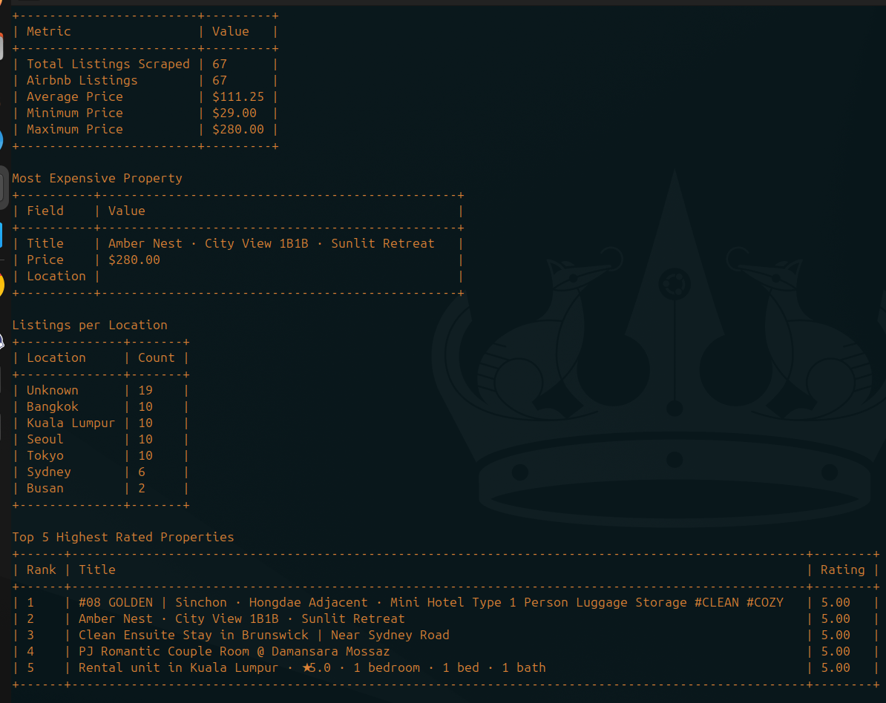

# Rental Scraping

A Go-based Airbnb scraping pipeline that:
- discovers homepage location/category spans dynamically from Airbnb,
- scrapes listing cards and detail pages concurrently,

## Features
- Click-driven scraping from homepage spans (`<a>` links in homepage carousels).
- Per span workflow: click span -> scrape page 1 + page 2 -> return homepage -> repeat for next span.
- Category-aware scraping from homepage sections (for example: `Popular homes in ...`, `Stay in ...`).
- Concurrent detail-page workers.
- Domain rate limiting and request caps.
- Dual persistence:
  - flat CSV export for easy sharing/analysis,
  - PostgreSQL upsert for durable storage.


## Project Structure
```text
.
├── main.go                     # CLI entrypoint and flag parsing
├── services/
│   ├── config.go               # Scraper service config model
│   ├── scraper.go              # Core scraping orchestration + parsing
│   └── worker.go               # Concurrent detail worker pool
├── storage/
│   └── persistence.go          # CSV + PostgreSQL persistence
├── utils/
│   └── env.go                  # Environment helper utilities
├── models/
│   └── model.go                # Listing model
├── docker-compose.yml          # Local PostgreSQL service
└── .env.postgres.example       # Example DB environment values
```


## Setup
1. Clone and enter the repository.
```bash
git clone https://github.com/saidurcsesust/Rental-Scraping.git
cd Rental-Scraping
```
2. Download Go modules:
```bash
go mod download
```
3. Create env file from example (optional but recommended):
```bash
cp .env.postgres.example .env
```
4. Load `.env` values before running app:
```bash
set -a
source .env
set +a
```

You can edit `.env` for custom database values:
```env
DB_HOST=127.0.0.1
DB_PORT=5433
DB_USER=postgres
DB_PASSWORD=postgres
DB_NAME=rental_scraping
DB_SSLMODE=disable
```

## Run PostgreSQL (Docker)
Start local PostgreSQL using the provided compose file:
```bash
docker compose --env-file .env.postgres.example up -d postgres
```

Check status:
```bash
docker compose ps
```

Stop database:
```bash
docker compose down
```

## Run the Scraper
```bash
./run.sh
```


## Insights Screenshot

Terminal insights report example:




## CLI Flags
| Flag | Default | Description |
|---|---|---|
| `-search-url` | `https://www.airbnb.com/` | Airbnb homepage URL |
| `-max-pages` | `3` | Legacy fallback setting (not used in click-only homepage flow) |
| `-workers` | `5` | Number of concurrent detail workers |
| `-rate` | `1.0` | Requests per second per domain |
| `-burst` | `2` | Rate limiter burst per domain |
| `-max-inflight-domain` | `3` | Max in-flight requests per domain |
| `-max-total-domain` | `300` | Max total requests per domain |
| `-timeout-sec` | `30` | Request timeout in seconds |
| `-retries` | `2` | Retry count per page |
| `-output` | `airbnb_listings.csv` | Output CSV file path |
| `-max-spans` | `0` | Max homepage spans to click (`0` = all discovered) |
| `-pages-per-span` | `2` | Pages to scrape per span |
| `-cards-per-page` | `5` | Listing cards to capture per page |
| `-headless` | `true` | Run browser in headless mode |
| `-db-host` | `127.0.0.1` | PostgreSQL host |
| `-db-port` | `5433` | PostgreSQL port |
| `-db-user` | `postgres` | PostgreSQL user |
| `-db-password` | `postgres` | PostgreSQL password |
| `-db-name` | `rental_scraping` | PostgreSQL database name |
| `-db-sslmode` | `disable` | PostgreSQL SSL mode |


## Output: PostgreSQL
If `DB_HOST` (or `-db-host`) is set, data is also saved to PostgreSQL.

### Table
`listings` is auto-created/updated with this schema:
- `id BIGSERIAL PRIMARY KEY`
- `title TEXT NOT NULL`
- `price TEXT`
- `location TEXT`
- `rating TEXT`
- `category TEXT NOT NULL DEFAULT 'Uncategorized'`
- `url TEXT NOT NULL UNIQUE`
- `description TEXT`
- `details JSONB NOT NULL DEFAULT '{}'::jsonb`
- `created_at TIMESTAMPTZ NOT NULL DEFAULT NOW()`
- `updated_at TIMESTAMPTZ NOT NULL DEFAULT NOW()`


### View more columns
```bash
docker exec -it rental_scraping_postgres \
  psql -U postgres -d rental_scraping \
  -c "SELECT id, category, title, price, location, rating, url, updated_at FROM listings ORDER BY id LIMIT 100;"
```

### Count rows
```bash
docker exec -it rental_scraping_postgres \
  psql -U postgres -d rental_scraping \
  -c "SELECT COUNT(*) FROM listings;"
```
